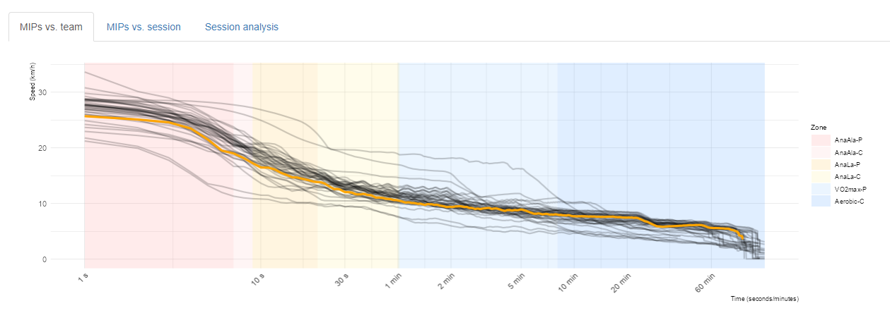
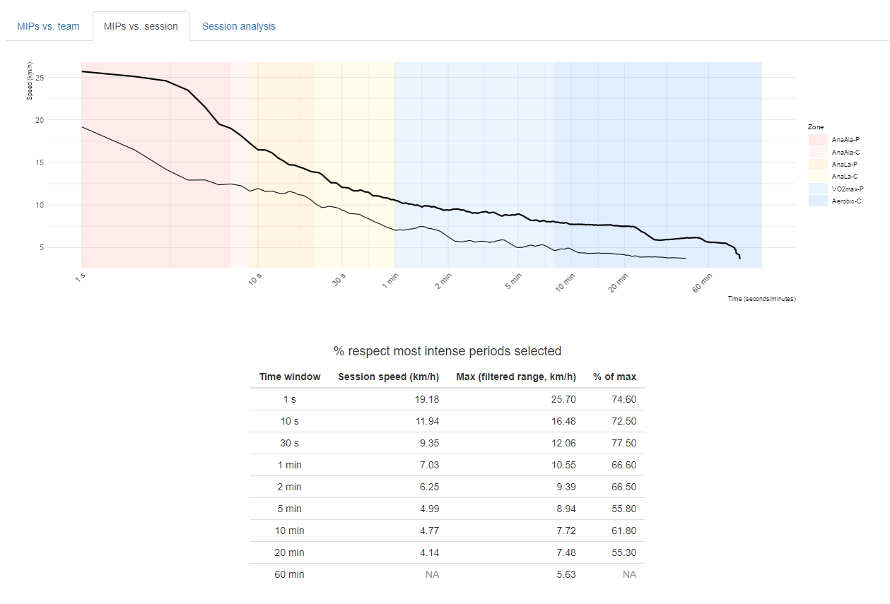
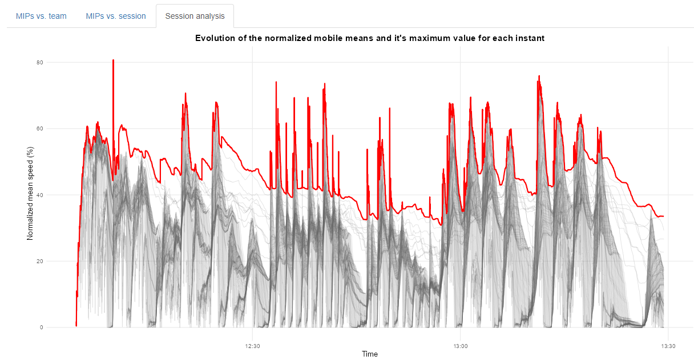
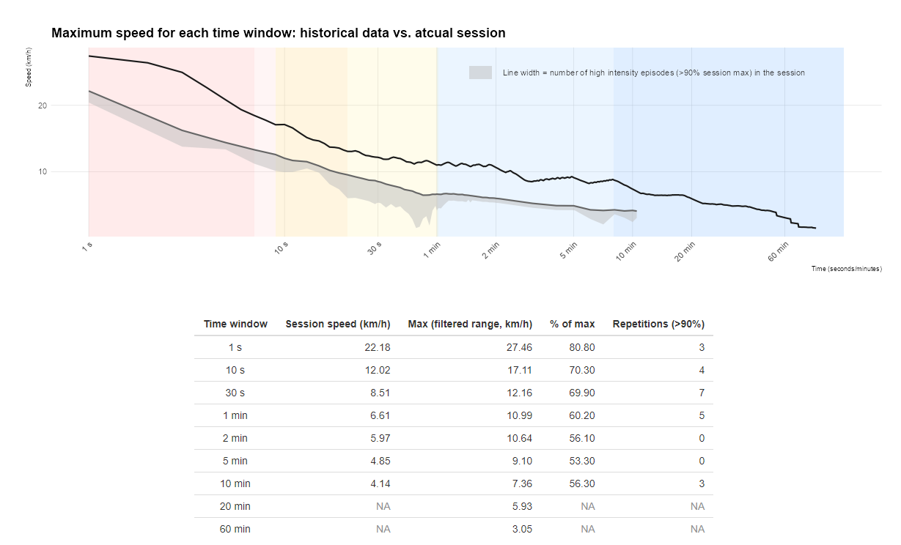

# Critical Speed Analysis

This repository contains a collection of R functions for processing and preparing **raw data** from **two seasons of women’s football (Soccermon)**. It also includes a **Shiny App** that enables interactive exploration of both seasons, focusing on the concepts of **maximum-demand scenarios** and **critical speed**.

You can access a live example of the Shiny App at the following link: **[HERE]**\
*(Note: The last tab of the app is currently non-functional in the online version.)*

## Functions Overview

### `download2020data()`

Downloads the raw data from the **Zenodo online repository** and stores all files in a local folder.

> **Note:** This process can take a long time due to the large file sizes. Ensure sufficient local storage before running the function.\
> These data include numerous raw files from multiple training sessions across two full seasons.

### `load_data()`

Converts the stored files from **PARQUET** format to **RDS**, significantly reducing storage size.

-   Only needs to be executed **once**.

-   Takes time to complete, as it processes a large number of files.

### `create_database_fast()`

Main function to build a **summary database** that aggregates all training sessions and matches.

-   Minimum runtime: approximately **1 hour**, depending on system performance.

-   Generates one summarized entry per session and player, containing:

```         
-   Session duration

-   Total distance

-   Distance \> 21 km/h

-   Number of sprints \> 21 km/h

-   PlayerLoad

-   Mean heart rate

-   Maximum heart rate
```

### `moving_averages_fast()`

Computes **moving averages** for multiple time windows (e.g., 3, 5, 10 seconds) across all training sessions for each player, based on **speed**.

-   Produces a dataset identifying the **best performance moments** for each player across different time frames.

-   This is the **primary analytical function** used to estimate **each player’s critical speed**.

-   Computationally intensive due to the number of sessions processed.

### `moving_averages_ind_fast()`

Performs a detailed **individual moving-window analysis** on the speed variable across numerous time windows (1, 2, 3, 4 seconds, etc.).

-   Designed for optimization, but still computationally demanding.

-   Returns a dataset providing, for each player and session, the **maximum mean values** of speed for each analyzed time window.

### `df_historic_ind_max()`

Utility function that allows filtering and extracting **historical maximum values** for each player within a user-defined time range of the season.

## App Overview

### `app.R`

This file contains the code for a **Shiny App** designed to visualize and analyze all the data.\
The app includes **three main tabs** for exploring and comparing players’ top speed performances:

### 1. **MIPs vs. Team**

Compares a player’s metrics with the rest of the team to identify her relative position within the group.

-   Allows filtering by date range to analyze specific periods of the season.

    

### 2. **MIPs vs. Session**

Compares each player’s **season-long individual records** with those from a **specific training session**.

-   Helps visualize how close or far a player was from her best performances during a given session.

-   Includes filters to select the desired time range within the season.

-   Also provides a **summary data table** with key metrics.

    

### 3. **Session Analysis**

> ⚠️ Currently, this feature only works when running the app **locally** (it is not functional on the hosted shinyapps.io version).

This tab allows you to:

-   Upload a session file in **RDS format**.

-   Automatically analyze multiple time windows within the uploaded session.

-   Assess:

    -   The structure and intensity of the training session.

    -   How close the player’s efforts were to her historical maximums.

    -   The number of repetitions performed within each time window.

> The analysis typically takes around **30–40 seconds** to complete due to the heavy computational processing involved.




